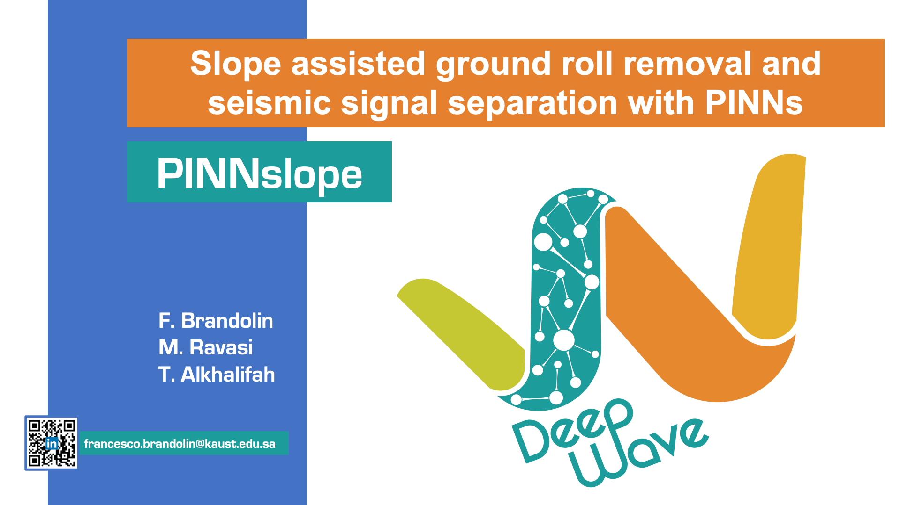

Reproducible material for **Slope assisted ground roll removal and seismic signal separation with Physics Informed Neural Networks - Brandolin F., Ravasi M., Alkhalifah  T.**


## Project structure
This repository is organized as follows:

* :open_file_folder: **signal_sep_pinns**: python library containing routines for "PINNslope" seismic data interpolation and local slope estimation with physics informed neural networks;
* :open_file_folder: **data**: folder containing input data and results;
* :open_file_folder: **notebooks**: set of jupyter notebooks reproducing the experiments in the paper (see below for more details);
* :open_file_folder: **asset**: folder containing logo;

## Notebooks
The following notebooks are provided:

- :orange_book: ``ground_roll.ipynb`` : reproduces the ground roll removal numerical examples.
- :orange_book: ``interp_and_deb.ipynb`` : reproduces the interpolation and deblending numerical examples.
- :orange_book: ``slope_comparison.ipynb`` : compares the slope estimate of different slope estimation algorithms (PINNslope, Structure tensor, PWD) against the analytical solution.
- :orange_book: ``visualization_ground_roll.ipynb`` : reproduces the Figures of the paper for the ground roll removal numerical examples.  
- :orange_book: ``visualization_interp_and_deb.ipynb`` : reproduces the Figures of the paper for the interpolation and deblending numerical examples.  


## Getting started
To ensure reproducibility of the results, we suggest using the `environment.yml` file when creating an environment.

Simply run:
```
./install_env.sh
```
It will take some time, if at the end you see the word `Done!` on your terminal you are ready to go. Activate the environment by typing:
```
conda activate envsspinn
```

After that you can simply install your package:
```
pip install .
```
or in developer mode:
```
pip install -e .
```

**Disclaimer:** All experiments have been carried on a Intel(R) Xeon(R) CPU @ 2.10GHz equipped with a single NVIDIA GEForce RTX 3090 GPU. Different environment 
configurations may be required for different combinations of workstation and GPU.


## Cite Us
Brandolin, F., Ravasi, M. and Alkhalifah, T. (2025) Slope assisted Physics-informed neural networks for seismic signal separation with applications on ground roll removal and interpolation. Geophysical Prospecting, 73, 1337–1363. [DOI: 10.1111/1365-2478.70004](https://doi.org/10.1111/1365-2478.70004)
 
 Please use the following BibTeX entry to cite this work:

```bibtex
@article{https://doi.org/10.1111/1365-2478.70004,
  author  = {Brandolin, Francesco and Ravasi, Matteo and Alkhalifah, Tariq},
  title   = {Slope assisted Physics-informed neural networks for seismic signal separation with applications on ground roll removal and interpolation},
  journal = {Geophysical Prospecting},
  volume  = {73},
  number  = {5},
  pages   = {1337-1363},
  keywords = {data processing, ground roll, interpolation, local slopes, physics-informed neural networks, seismics, signal processing, signal separation},
  doi     = {https://doi.org/10.1111/1365-2478.70004},
  url     = {https://onlinelibrary.wiley.com/doi/abs/10.1111/1365-2478.70004},
  eprint  = {https://onlinelibrary.wiley.com/doi/pdf/10.1111/1365-2478.70004},
  year    = {2025}
}
